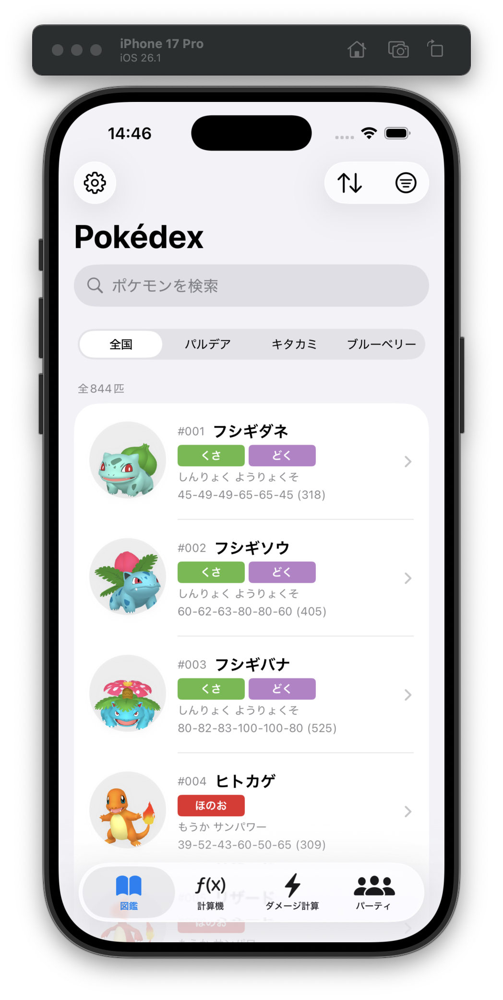
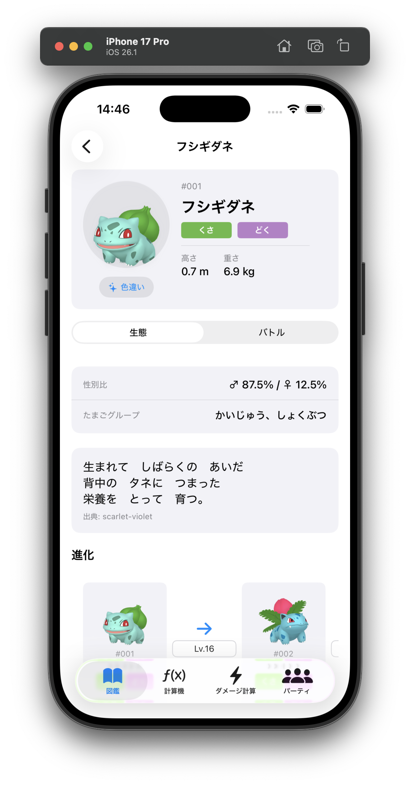
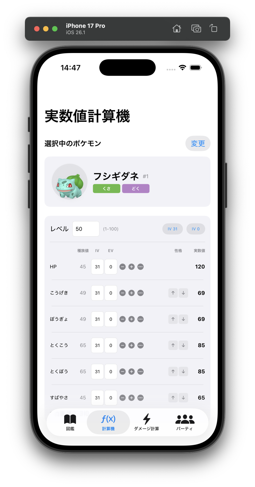
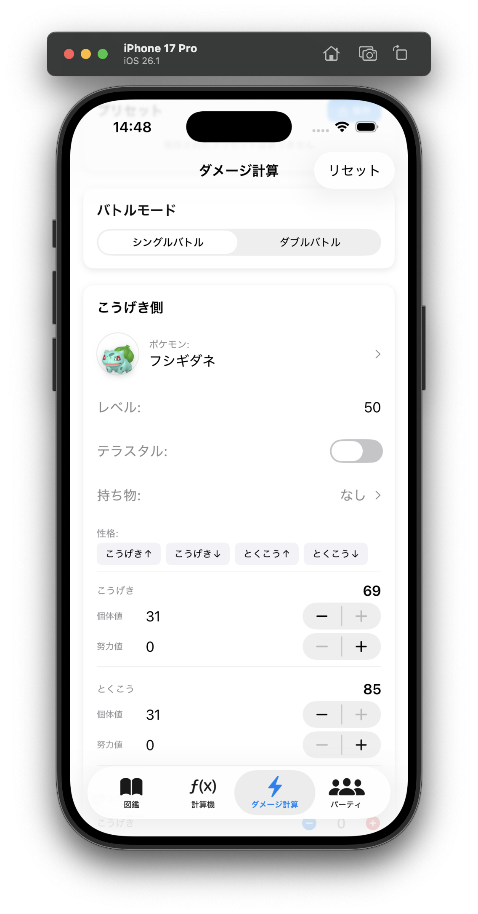
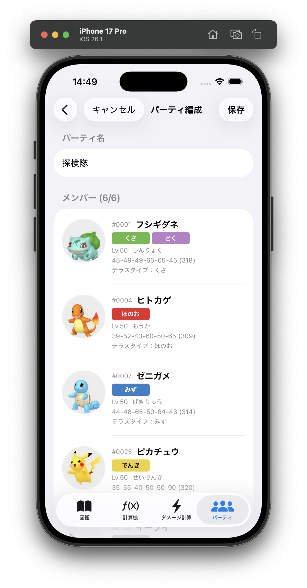
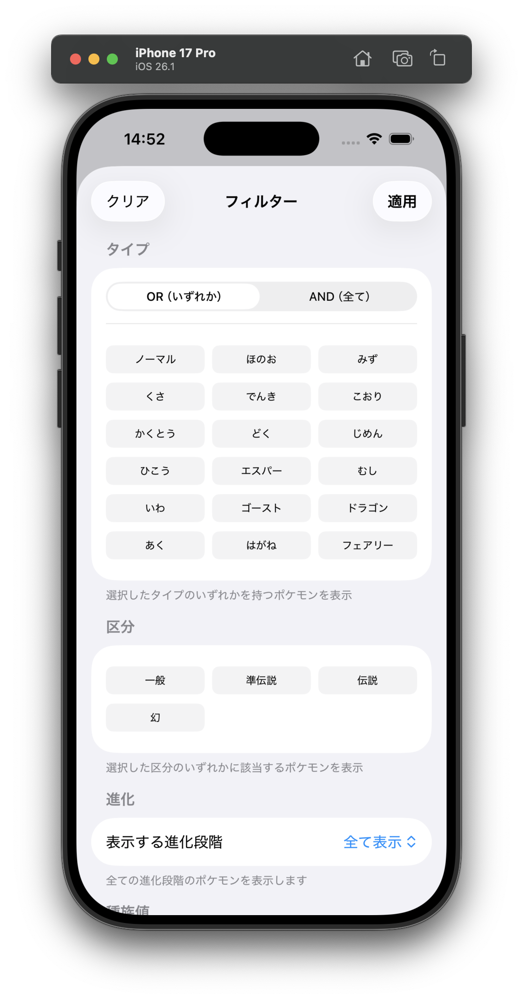

# ScarletViolet-Pokedex-SwiftUI

ポケットモンスター スカーレット・バイオレット対応のポケモン図鑑アプリ（SwiftUI製）

## 機能

### ポケモン図鑑
- 全844匹のポケモンの検索・閲覧
- 図鑑フィルター（全国、パルデア、キタカミ、ブルーベリー）
- 多様なフィルタリング
  - タイプ（OR/AND条件）
  - 区分（一般・準伝説・伝説・幻）
  - 進化段階（全て表示・未進化・最終進化・進化なし）
  - 種族値条件
  - 特性・技
- ソート機能（図鑑番号、名前、種族値合計）
- ポケモン詳細表示
  - 生態情報（図鑑説明、タマゴグループ、性別比、出現場所）
  - バトル情報（種族値、タイプ相性、特性、技リスト）
  - 進化系統

### 実数値計算機
- ポケモン選択
- レベル・個体値・努力値の入力
- 性格補正の設定
- 実数値の自動計算・表示

### ダメージ計算
- バトルモード選択（シングル/ダブルバトル）
- 攻撃側・防御側のポケモン設定
  - レベル・個体値・努力値・性格
  - テラスタイプ
  - 持ち物

### パーティ編成
- 複数パーティの作成・保存・管理
- 各パーティに最大6匹のポケモンを登録
- ポケモンごとの詳細設定
  - テラスタイプ（18通常タイプ + ステラ）
  - 技選択（最大4つ）
  - 特性・持ち物
  - 性格・個体値・努力値
  - レベル（1-100）
  - ニックネーム

## スクリーンショット

| ポケモン図鑑 | ポケモン詳細 | 実数値計算機 |
|:---:|:---:|:---:|
|  |  |  |

| ダメージ計算 | パーティ編成 | フィルター |
|:---:|:---:|:---:|
|  |  |  |

## 技術スタック

- SwiftUI
- SwiftData（ローカルデータ永続化）
- Clean Architecture
- iOS 17.0+