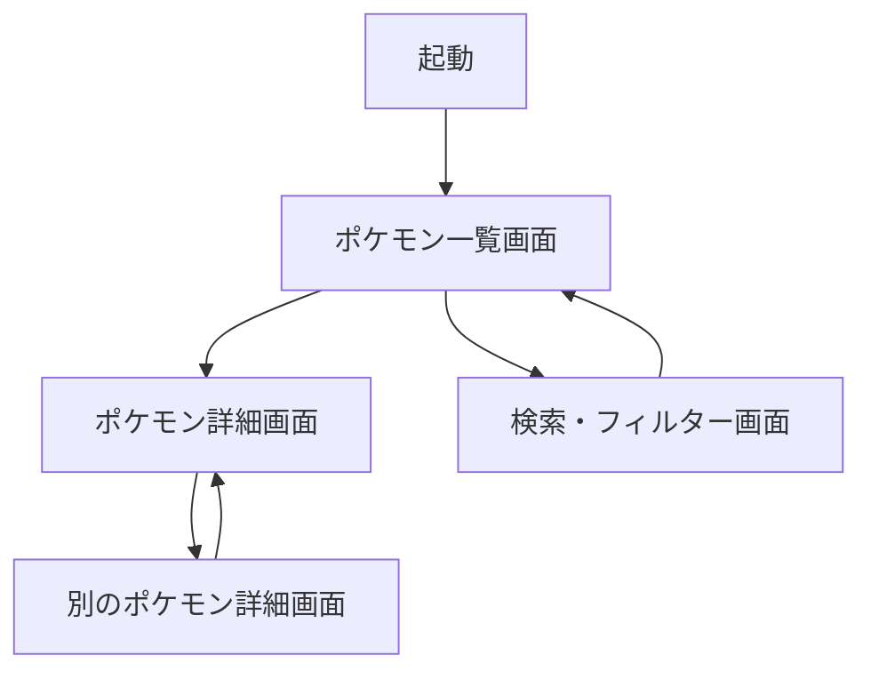

# 要件定義書 - Pokédex SwiftUI

## 📋 プロジェクト概要

| 項目 | 内容 |
|------|------|
| プロジェクト名 | Pokédex SwiftUI |
| 目的 | ポケモンファン向けの図鑑アプリ |
| 開発期間 | 1ヶ月 |
| 対象ポケモン | 第1世代(151匹) |
| 最低iOS | iOS 17.0+ |
| 対応デバイス | iPhone専用 |

## 🎯 機能要件

### Phase 1: MVP(Week 1-2)

#### 1.1 ポケモン一覧画面

**概要**  
初代151匹のポケモンをリスト形式で表示する画面

**表示内容**
- ポケモン画像(正面)
- 図鑑番号(例: #001)
- 名前(例: フシギダネ)
- タイプ(最大2つ)

**操作**
- 行タップでポケモン詳細画面へ遷移
- ツールバーに検索/フィルターボタン

**表示形式**
- List形式
- (Phase 3で余裕があればLazyVGridでグリッド対応)

---

#### 1.2 ポケモン詳細画面

**概要**  
選択したポケモンの詳細情報を表示する画面

**表示内容**

##### 基本情報
- ポケモン画像(正面のみ)
- 図鑑番号
- 名前
- タイプ(1〜2個)
- 身長(m単位)
- 体重(kg単位)

##### ステータス(種族値)
- HP
- こうげき
- ぼうぎょ
- とくこう
- とくぼう
- すばやさ

**表示方法**: Progressバー(横棒グラフ)

##### 特性
- 通常特性(1〜2個)
- 隠れ特性(ある場合のみ)

##### 進化チェーン
- 進化前・進化後のポケモンを横並びで表示
- 例: `フシギダネ → フシギソウ → フシギバナ`

##### 覚える技
- 習得方法選択UI(Pickerメニュー)
  - レベルアップ
  - マシン
  - タマゴ技
  - 教え技
- 選択した習得方法で覚える技のリストを表示
- 技名とレベルを表示

**操作**
- Toggleで色違い切り替え
  - ONで色違い画像を表示
  - OFFで通常色を表示
- Pickerで習得方法選択、技リストを更新

---

### Phase 2: 検索・フィルター機能(Week 3)

#### 2.1 検索・フィルター画面

**概要**  
ポケモンを検索・絞り込みするための画面

**機能**

##### 名前検索
- SearchBarで入力
- 部分一致で検索

##### タイプフィルター
- 全18タイプから選択
- 複数選択可能
- 選択したタイプを持つポケモンを表示

##### 世代別フィルター
- 第1世代〜最新世代から選択
- 今回は第1世代のみ実装

**操作**
- Sheetで表示
- 適用ボタンで絞り込み結果を一覧画面に反映
- クリアボタンで絞り込み条件をリセット

---

### Phase 3: UI改善(Week 4 - 余裕があれば)

#### 3.1 表示形式切り替え

- リスト表示(List) ⇔ グリッド表示(LazyVGrid)
- ツールバーのボタンで表示形式を変更

---

## 🚫 対象外機能

以下の機能は今回のスコープに含めません:

- 背面画像の表示
- 説明文(フレーバーテキスト)
- 出現場所
- オフライン対応(キャッシュのみ)
- iPad対応
- お気に入り機能
- 性別による見た目の違い
- 鳴き声再生
- タイプ相性チェッカー
- ポケモン同士の比較機能

---

## 🛡️ 非機能要件

### パフォーマンス

**API呼び出し最適化**
- 初回起動時のリスト取得は1回のみ
- 詳細情報は必要な時のみ取得
- 並列リクエスト数を5個以下に制限
- 取得済みデータは@StateObjectでキャッシュ

**画像読み込み最適化**
- AsyncImageまたはKingfisherによる自動キャッシュ
- Lazyスタックによる遅延読み込み

### 信頼性

**エラーハンドリング**
- ネットワークエラー時はAlertでメッセージ表示
- リトライ機能(最大3回まで)
- タイムアウト処理(10秒)

### ユーザビリティ

**ローディング表示**
- データ取得中はProgressView表示
- 長時間かかる場合は進捗表示

**直感的な操作**
- タップ可能な要素を明確に
- 画面遷移はNavigationStackで管理

### セキュリティ

- HTTPS通信のみ(PokéAPIはHTTPSをサポート)
- App Transport Securityの設定

### PokéAPI利用規約の遵守

- フェアユース・ポリシーの遵守
- リソースのローカルキャッシュ
- 過度なリクエストを避ける
- サーバーへの負荷を最小限に

---

## 🎨 UI/UXガイドライン

### デザイン方針

- iOS Human Interface Guidelines(SwiftUI)に準拠
- システムカラーを中心に使用
- システムフォント使用
- シンプル・ミニマルなデザイン

### カラー

- プライマリーカラー: .blue
- セカンダリーカラー: .gray
- タイプ別カラー: ポケモンのタイプに応じた色

### アニメーション

- 画面遷移: デフォルトのNavigationアニメーション
- リスト表示: デフォルトのアニメーション
- 色違い切り替え: withAnimationで滑らかに

---

## 🔧 技術スタック

### 開発環境

| 項目 | 内容 |
|------|------|
| 開発言語 | Swift 5.9+ |
| UIフレームワーク | SwiftUI |
| 最低iOS | iOS 17.0 |
| Xcode | 15.0+ |

### アーキテクチャ

- Clean Architecture
- MVVM(Model-View-ViewModel)
- 依存性注入(DI)

### 使用ライブラリ

| ライブラリ | 用途 | インストール方法 |
|-----------|------|----------------|
| [PokemonAPI](https://github.com/kinkofer/PokemonAPI) | PokéAPI通信 | Swift Package Manager |
| [Kingfisher](https://github.com/onevcat/Kingfisher) | 画像キャッシュ(オプション) | Swift Package Manager |

### 非同期処理

- async/await
- Task
- TaskGroup(並列処理)
- @MainActor

### 状態管理

- @State
- @StateObject
- @ObservedObject
- @Published(ViewModel内)
- @EnvironmentObject(DIコンテナ用)

### データ保存

- メモリキャッシュのみ(ViewModelで管理)
- UserDefaults、Core Dataは使用しない

### テスト

- XCTest
- 主要なViewModelとUseCaseのユニットテストのみ
- カバレッジ目標: 最小限

---

## 📐 画面フロー



### 画面遷移詳細

1. **起動 → ポケモン一覧画面**
   - アプリ起動時に自動遷移

2. **ポケモン一覧画面 → ポケモン詳細画面**
   - NavigationLinkでプッシュ遷移

3. **ポケモン詳細画面 → 別のポケモン詳細画面**
   - 進化チェーン内のNavigationLinkでプッシュ遷移

4. **ポケモン一覧画面 → 検索・フィルター画面**
   - .sheet()でモーダル表示

5. **検索・フィルター画面 → ポケモン一覧画面**
   - 適用ボタンで@Bindingを更新してSheet閉じる

---

## 📊 データフロー

### ポケモンリスト取得

```
1. View表示 → ViewModel: .task { }でデータ取得開始
2. ViewModel → UseCase: ポケモンリスト取得を要求
3. UseCase → Repository: リスト取得を依頼
4. Repository → PokemonAPI: APIリクエスト
5. PokemonAPI → Repository: レスポンス(151匹分)
6. Repository → UseCase: Pokemonエンティティのリストを返す
7. UseCase → ViewModel: リストを返す
8. ViewModel: @Publishedプロパティを更新
9. View: 自動的に再描画
```

### ポケモン詳細取得

```
1. View表示 → ViewModel: .task { }でデータ取得開始
2. ViewModel → UseCase: ポケモン詳細取得を要求
3. UseCase → Repository: キャッシュ確認
4-a. キャッシュあり → Repository: キャッシュから返す
4-b. キャッシュなし → Repository → PokemonAPI: APIリクエスト
5. Repository → UseCase: Pokemonエンティティを返す
6. UseCase → ViewModel: 詳細データを返す
7. ViewModel: @Publishedプロパティを更新
8. View: 自動的に再描画
```

---

## 📅 開発スケジュール

### Week 1: 基盤構築

| 日 | タスク |
|----|--------|
| Day 1-2 | プロジェクト作成、Domain層設計・実装 |
| Day 3-4 | Data層実装(PokemonAPI連携、Repository) |
| Day 5-7 | ポケモン一覧画面(View + ViewModel) |

**成果物**
- プロジェクト構成完成
- Domain/Dataレイヤー実装完了
- 一覧画面で151匹表示可能

---

### Week 2: 詳細画面

| 日 | タスク |
|----|--------|
| Day 8-10 | 詳細画面View(基本情報、ステータスグラフ) |
| Day 11-12 | 進化チェーン表示・遷移 |
| Day 13-14 | 覚える技表示、世代選択、色違い切り替え |

**成果物**
- 詳細画面完成
- 基本的な図鑑機能が動作

---

### Week 3: 検索・フィルター

| 日 | タスク |
|----|--------|
| Day 15-17 | 検索機能(名前検索) |
| Day 18-19 | タイプフィルター |
| Day 20-21 | 世代別フィルター、性別表示 |

**成果物**
- 検索・フィルター機能完成
- MVP完成

---

### Week 4: 仕上げ

| 日 | タスク |
|----|--------|
| Day 22-24 | UI調整、エラーハンドリング改善 |
| Day 25-26 | ユニットテスト作成 |
| Day 27-28 | README作成、ドキュメント整備 |
| Day 29-30 | (余裕があれば)グリッド表示実装 |

**成果物**
- プロダクション品質の完成
- ドキュメント完備
- GitHub公開準備完了

---

## 📝 SwiftUI特有の実装ポイント

### ViewとViewModelの分離

```swift
// View
struct PokemonListView: View {
    @StateObject private var viewModel = PokemonListViewModel()
    
    var body: some View {
        List(viewModel.pokemons) { pokemon in
            NavigationLink(value: pokemon) {
                PokemonRow(pokemon: pokemon)
            }
        }
        .task {
            await viewModel.loadPokemons()
        }
    }
}

// ViewModel
@MainActor
class PokemonListViewModel: ObservableObject {
    @Published var pokemons: [Pokemon] = []
    @Published var isLoading = false
    
    private let fetchPokemonListUseCase: FetchPokemonListUseCase
    
    func loadPokemons() async {
        // データ取得処理
    }
}
```

### NavigationStackの使用

iOS 16+で導入されたNavigationStackを使用:

```swift
NavigationStack {
    PokemonListView()
}
.navigationDestination(for: Pokemon.self) { pokemon in
    PokemonDetailView(pokemon: pokemon)
}
```

### 環境オブジェクトでDI

```swift
@main
struct PokedexApp: App {
    @StateObject private var container = DIContainer()
    
    var body: some Scene {
        WindowGroup {
            ContentView()
                .environmentObject(container)
        }
    }
}
```

---

## 📂 プロジェクト構成

```
Pokedex-SwiftUI/
├── Pokedex.xcodeproj
├── Pokedex/
│   ├── PokedexApp.swift
│   │
│   ├── Domain/
│   │   ├── Entities/
│   │   │   ├── Pokemon.swift
│   │   │   ├── PokemonType.swift
│   │   │   └── PokemonStat.swift
│   │   ├── UseCases/
│   │   │   ├── FetchPokemonListUseCase.swift
│   │   │   └── FetchPokemonDetailUseCase.swift
│   │   └── Interfaces/
│   │       └── PokemonRepositoryProtocol.swift
│   │
│   ├── Data/
│   │   ├── Repositories/
│   │   │   └── PokemonRepository.swift
│   │   └── Network/
│   │       └── PokemonAPIClient.swift
│   │
│   ├── Presentation/
│   │   ├── PokemonList/
│   │   │   ├── PokemonListView.swift
│   │   │   ├── PokemonListViewModel.swift
│   │   │   └── Components/
│   │   │       └── PokemonRow.swift
│   │   ├── PokemonDetail/
│   │   │   ├── PokemonDetailView.swift
│   │   │   ├── PokemonDetailViewModel.swift
│   │   │   └── Components/
│   │   │       ├── PokemonHeaderView.swift
│   │   │       ├── PokemonStatsView.swift
│   │   │       └── EvolutionChainView.swift
│   │   └── Search/
│   │       ├── SearchView.swift
│   │       └── SearchViewModel.swift
│   │
│   ├── Application/
│   │   └── DIContainer.swift
│   │
│   └── Resources/
│       ├── Assets.xcassets
│       └── Info.plist
│
├── PokedexTests/
│   └── ViewModelTests/
│
└── README.md
```

---

## ✅ 承認

この要件定義書の内容で開発を進めます。

変更が必要な場合は、このドキュメントを更新してバージョン管理します。

---

**最終更新日**: 2025-10-04  
**バージョン**: 1.0.0 (SwiftUI版)